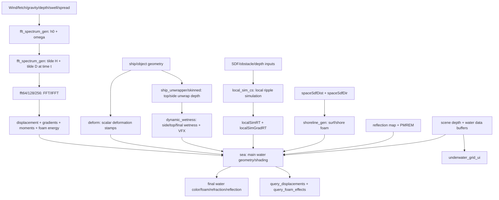
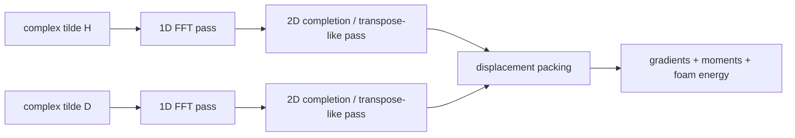
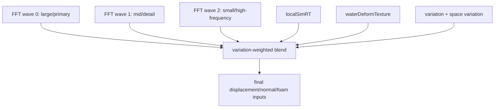
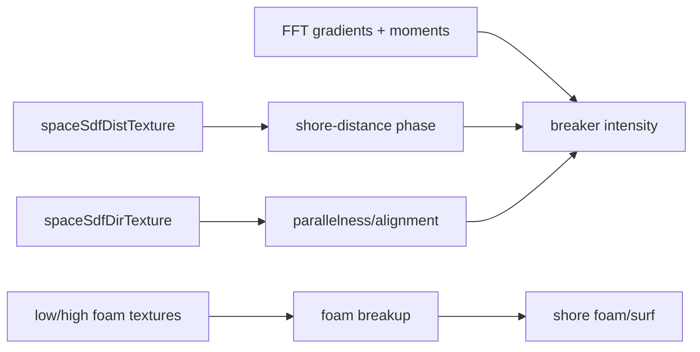
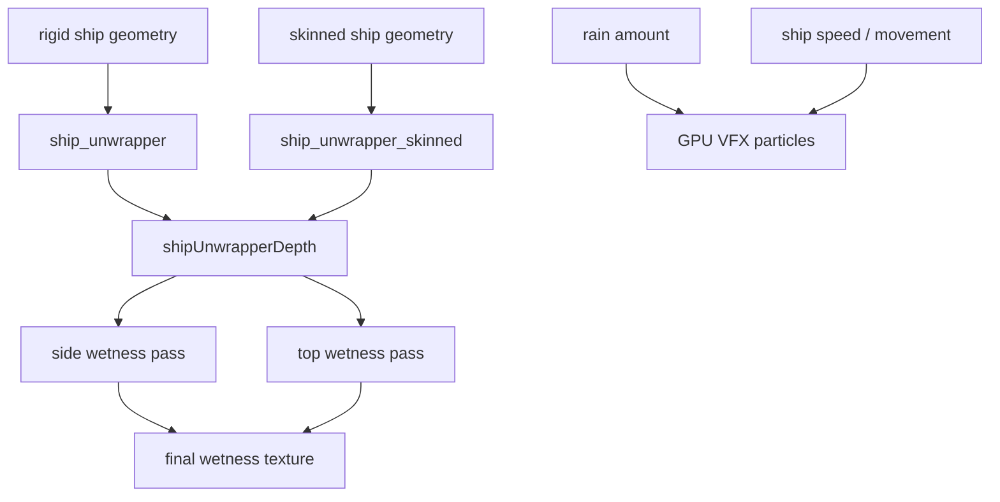

# World of Warships Water Shader Notes

_Source material: decompiled pseudo-HLSL from the provided `readable_out(5).zip` bundle. These files are reconstructed from compiled shader bytecode, not original source. Reflected resource names, constant-buffer names, shader profiles, thread-group sizes, and binding declarations are the strongest evidence; local variable names and source-level function structure are not preserved._

## Reading conventions

- **High confidence**: directly supported by reflected names, resource bindings, profiles, thread groups, or obvious bytecode arithmetic.
- **Medium confidence**: supported by visible shader structure plus standard water-rendering practice.
- **Speculation**: marked with a warning callout.
- Inline equations use `$...$`; block equations use `$$...$$`.

> [!WARNING]
> This is a reverse-engineering note, not Wargaming source code and not recompilable HLSL.

## Executive summary

The shader bundle describes a hybrid ocean renderer:

1. **Spectral FFT ocean** for far/mid-field water. `fft_spectrum_gen` creates and evolves complex wave spectra; `fft64_cs`, `fft128_cs`, and `fft256_cs` perform FFT/IFFT work and pack displacement, gradients, moments, and foam energy.
2. **Near-field interaction layers** for ships, wakes, ripples, wetness, and local disturbances. These come from `local_sim_cs`, `deform`, `ship_unwrapper`, `ship_unwrapper_skinned`, and `dynamic_wetness`.
3. **Main water shading** in `sea.win.dx11.pseudo.hlsl`, which has 330 shader variants and combines wave layers, deformation, local sim, foam, refraction, reflection, PMREM environment lighting, shadows, shoreline SDFs, water depth buffers, and special underwater/UI modes.
4. **Auxiliary compute/render paths** for reflection processing, shoreline foam, height queries, foam-effect queries, underwater grid UI, and wetness atlas generation.

## File inventory

| File | Shader count | Profiles | Role |
|---|---:|---|---|
| `deform.win.dx11.pseudo.hlsl` | 8 | ps_5_0×4, vs_5_0×4 | Water-deformation mask/height-stamp drawing from geometry. |
| `dynamic_wetness.win.dx11.pseudo.hlsl` | 4 | cs_5_0×4 | Ship wetness atlas updates and wetness/water GPU VFX spawning. |
| `fft128_cs.win.dx11.pseudo.hlsl` | 4 | cs_5_0×4 | 128² FFT/IFFT and displacement/gradient/moment/foam packing. |
| `fft256_cs.win.dx11.pseudo.hlsl` | 4 | cs_5_0×4 | 256² FFT/IFFT and displacement/gradient/moment/foam packing. |
| `fft64_cs.win.dx11.pseudo.hlsl` | 4 | cs_5_0×4 | 64² FFT/IFFT and displacement/gradient/moment/foam packing. |
| `fft_spectrum_gen.win.dx11.pseudo.hlsl` | 3 | cs_5_0×3 | Initial wave-spectrum generation and time evolution. |
| `local_sim_cs.win.dx11.pseudo.hlsl` | 5 | cs_5_0×3, ps_5_0×1, vs_5_0×1 | Near-field local ripple simulation, gradients, obstacles, recentering. |
| `query_displacements_cs.win.dx11.pseudo.hlsl` | 2 | cs_5_0×2 | Water-height/displacement queries for arbitrary points. |
| `query_foam_effects_cs.win.dx11.pseudo.hlsl` | 1 | cs_5_0×1 | Screen/world foam-effect candidate query generation. |
| `reflection.win.dx11.pseudo.hlsl` | 5 | ps_4_0×3, vs_4_0×2 | Reflection texture/depth/mip helper passes. |
| `sea.win.dx11.pseudo.hlsl` | 330 | ds_5_0×5, hs_5_0×1, ps_5_0×307, vs_5_0×17 | Main water geometry and shading, including FFT layers, local sim, foam, reflection/refraction, shoreline, lighting, and underwater variants. |
| `ship_unwrapper.win.dx11.pseudo.hlsl` | 2 | ps_5_0×1, vs_5_0×1 | Rigid ship unwrap into wetness/depth texture space. |
| `ship_unwrapper_skinned.win.dx11.pseudo.hlsl` | 2 | ps_5_0×1, vs_5_0×1 | Skinned ship unwrap into wetness/depth texture space. |
| `shoreline_gen.win.dx11.pseudo.hlsl` | 5 | ps_5_0×4, vs_5_0×1 | Shoreline foam/surf from SDFs, wave gradients/moments, and foam textures. |
| `underwater_grid_ui.win.dx11.pseudo.hlsl` | 6 | ps_5_0×4, vs_5_0×2 | Underwater/map-border/grid UI overlay using depth/normals. |

## Overall pipeline



## Major data products

| Resource/product | Evidence | Likely payload | Confidence |
|---|---|---|---|
| `g_h0OutTexture` | `fft_spectrum_gen` UAV | Initial complex spectral amplitudes $h_0(\mathbf{k})$ | High |
| `g_omegaOutTexture` | `fft_spectrum_gen` UAV | Angular frequency $\omega(\mathbf{k})$ | High |
| `g_tildeHOutTexture` | `fft_spectrum_gen` UAV | Time-evolved complex height spectrum $\tilde h(\mathbf{k},t)$ | High |
| `g_tildeDOutTexture` | `fft_spectrum_gen` UAV | Time-evolved complex horizontal displacement spectrum | High |
| `g_displacementOutTexture`, `g_fftWave*DispTexture` | FFT outputs sampled by `sea`, queries, wetness | Packed height/horizontal displacement | High |
| `g_gradientsOutTexture`, `g_fftWave*GradTexture` | FFT outputs sampled by `sea`, shoreline, foam queries | Slopes/gradients and helper terms | High |
| `g_momentsOutTexture`, `g_fftWave*Moments1Texture` | FFT outputs sampled by `sea` and `shoreline_gen` | Second moments / slope variance for filtering and shading | Medium |
| `g_foamEnergyInTexture`, `g_foamEnergyOutTexture` | FFT compute resources | Temporally accumulated foam energy | High |
| `g_localSimRT`, `g_localSimGradRT` | `local_sim_cs`/`sea` | Near-field ripple height/state and gradients | High |
| `g_waterDeformTexture` | `deform` output, sampled by `sea`, queries, wetness | Dynamic deformation/wake/splash stamp texture | High |
| `g_spaceSdfDistTexture`, `g_spaceSdfDirTexture` | shoreline/local/sea resources | Shoreline or map-space SDF distance/direction | High |
| `g_foamLowFreq`, `g_foamHighFreq` | sampled by `sea`, shoreline, foam query | Low/high frequency foam breakup textures | High |
| `g_waterDataZBuf`, `g_waterDataWaveTexCoordBuf`, `g_waterDataWaveTexCoordGradBuf` | `sea`/foam query resources | Per-pixel water depth, wave UVs, and wave UV gradients | Medium |
| `g_topWetnessTexture`, `g_sideWetnessTexture`, `g_finalWetnessTextureUAV` | `dynamic_wetness` | Ship wetness atlas layers | High |

## Spectral ocean generation

### Frequency grid

`fft_spectrum_gen` maps each compute thread to a centered wave-vector grid. The visible constants include multiplication by `6.283185`, which is $2\pi$, and division by `g_L`/patch length.

$$
\mathbf{k}_{ij}=\frac{2\pi}{L}
\begin{bmatrix}
i-N/2\\
j-N/2
\end{bmatrix},
\qquad
k=\lVert\mathbf{k}_{ij}\rVert
$$

The `g_cutoffLowHigh` parameter rejects waves outside a useful frequency band:

$$
S(\mathbf{k})=0
\quad\text{if}\quad
k<k_\text{low}\;\text{or}\;k>k_\text{high}.
$$

### Dispersion

The spectrum shader has `g_gravity`, `g_depth`, and writes `g_omegaOutTexture`. That strongly indicates gravity-wave dispersion. The finite-depth formula is:

$$
\omega(k)=\sqrt{gk\tanh(kh)}.
$$

Deep water is the $kh\to\infty$ limit:

$$
\omega(k)=\sqrt{gk}.
$$

> [!WARNING]
> **Speculation / reverse-engineered inference:** the exact helper formula is not named in the decompiled shader. Finite-depth dispersion is the standard physical formula matching the reflected parameters and observed hyperbolic-function-like arithmetic.

### Random complex spectrum

The shader uses integer hash/LCG-style arithmetic plus `log2`, square root, and `sincos`, which is consistent with Gaussian random generation. A standard initialization is:

$$
h_0(\mathbf{k})=\frac{1}{\sqrt{2}}(\xi_r+i\xi_i)
\sqrt{S(\mathbf{k})\Delta k_x\Delta k_y},
\qquad
\xi_r,\xi_i\sim\mathcal{N}(0,1).
$$

`g_h0OutTexture` is `float2`, matching a complex number `(real, imag)`.

### Spectrum shape

The reflected controls are the important clue: `g_windSpeed`, `g_fetch`, `g_spectrumAmplitude`, `g_peakEnhance`, `g_windAngle`, `g_spreadBlend`, `g_swell`, plus a matching `*LargeWave` set in one variant. That parameter set fits a JONSWAP/TMA-style wind spectrum with directional spread and swell blending.

A typical JONSWAP expression is:

$$
S(\omega)=\alpha g^2\omega^{-5}
\exp\left[-\frac{5}{4}\left(\frac{\omega_p}{\omega}\right)^4\right]
\gamma^{\exp\left[-\frac{(\omega/\omega_p-1)^2}{2\sigma^2}\right]}.
$$

A directional version multiplies by a spread term centered on the wind angle:

$$
S(\mathbf{k})=S(\omega(k))D(\theta-\theta_w),
\qquad
\theta=\operatorname{atan2}(k_z,k_x).
$$

A common spread model is:

$$
D(\theta)=C_s\max(0,\cos(\theta-\theta_w))^s.
$$

> [!WARNING]
> **Speculation / reverse-engineered inference:** this does not prove the literal source formula is textbook JONSWAP. It means the reflected knobs map very naturally to JONSWAP/TMA-style water.

### Time evolution

The final `fft_spectrum_gen` shader reads `g_h0Texture` and `g_omegaTexture`, uses `g_currSimTime`, and writes `g_tildeHOutTexture` and `g_tildeDOutTexture`. The standard Hermitian update is:

$$
\tilde h(\mathbf{k},t)=h_0(\mathbf{k})e^{i\omega t}+h_0^*(-\mathbf{k})e^{-i\omega t}.
$$

Horizontal displacement is derived by projecting height along the wave vector:

$$
\tilde{\mathbf{D}}(\mathbf{k},t)=-i\frac{\mathbf{k}}{k}\tilde h(\mathbf{k},t).
$$

This is the source of choppy wave motion.

## FFT/IFFT passes

`fft64_cs`, `fft128_cs`, and `fft256_cs` contain the same pass family at different resolutions. The first pass is a complex FFT-like butterfly in thread-group shared memory. Thread groups are `[numthreads(64,1,1)]`, `[numthreads(128,1,1)]`, or `[numthreads(256,1,1)]`; later packing/gradient passes use `[numthreads(16,16,1)]`.



The inverse transform is conceptually:

$$
h(\mathbf{x},t)=\sum_{\mathbf{k}}\tilde h(\mathbf{k},t)e^{i\mathbf{k}\cdot\mathbf{x}}.
$$

The shader applies the standard checkerboard sign correction:

$$
q'(x,y)=q(x,y)(-1)^{x+y}.
$$

## Displacement, normals, moments, and foam

A packed choppy surface position can be interpreted as:

$$
\mathbf{P}(x,z)=
\begin{bmatrix}
x+\lambda D_x(x,z)\\
h(x,z)\\
z+\lambda D_z(x,z)
\end{bmatrix},
$$

where `g_fftChoppyScale` is the likely $\lambda$ control.

Gradients use finite differences:

$$
\frac{\partial h}{\partial x}\approx\frac{h(x+\Delta x,z)-h(x-\Delta x,z)}{2\Delta x},
\qquad
\frac{\partial h}{\partial z}\approx\frac{h(x,z+\Delta z)-h(x,z-\Delta z)}{2\Delta z}.
$$

A height-field normal is:

$$
\mathbf{n}=\operatorname{normalize}
\begin{bmatrix}
-\partial h/\partial x\\
1\\
-\partial h/\partial z
\end{bmatrix}.
$$

The FFT gradient pass also computes a Jacobian-like term and updates `g_foamEnergyOutTexture`. In choppy water, foam appears where the surface compresses/folds:

$$
J=\left(1+\lambda\frac{\partial D_x}{\partial x}\right)
\left(1+\lambda\frac{\partial D_z}{\partial z}\right)
-\lambda^2\frac{\partial D_x}{\partial z}\frac{\partial D_z}{\partial x}.
$$

A generic foam update consistent with `g_waveFoamFadeRate` and `g_waveFoamCoverage` is:

$$
F_{t+1}=\operatorname{saturate}\left(F_t(1-r\Delta t)+a\operatorname{smoothstep}(J_0,J_1,J_\text{threshold}-J)\right).
$$

Second moments support distant filtering. If $p=\partial h/\partial x$ and $q=\partial h/\partial z$:

$$
\sigma_s^2=E[p^2]+E[q^2]-E[p]^2-E[q]^2.
$$

The names `momentsFresnelInfluence` and `momentsFresnelInfluenceStartDist` imply these moments affect distant Fresnel/specular behavior.

## Multi-scale wave layering

The main shader samples up to three FFT wave layers:

- `g_fftWave0DispTexture`, `g_fftWave0GradTexture`, `g_fftWave0Moments1Texture`
- `g_fftWave1DispTexture`, `g_fftWave1GradTexture`, `g_fftWave1Moments1Texture`
- `g_fftWave2DispTexture`, `g_fftWave2GradTexture`, `g_fftWave2Moments1Texture`

It also uses `g_variationTexture`, `g_spaceVariationTexture`, `wavesUVScale`, `wavesUVBias`, `variationMapOffset`, `variationMapPower`, `variationMapThreshold`, `variationMapScale`, `variationMapMinWave2Val`, and `variationMapThresholdSmooth`. The water is therefore not one repeating tile; it is a spatially varied blend of wave bands.

$$
\mathbf{D}_\text{total}=w_0\mathbf{D}_0+w_1\mathbf{D}_1+w_2\mathbf{D}_2+w_l\mathbf{D}_\text{local}+w_d\mathbf{D}_\text{deform}.
$$



## `sea` geometry path

`sea.win.dx11.pseudo.hlsl` has 17 vertex shaders, 1 hull shader, 5 domain shaders, and 307 pixel shaders. That means the engine has both non-tessellated and tessellated water variants. The reflected globals `g_tesselationAmount`, `g_gridSize`, `g_distanceScaleFactor`, and `g_originOffset` point to a camera-relative grid or projected grid.

A simplified camera-relative position is:

$$
\mathbf{x}_\text{world}=\mathbf{o}+s(d)\mathbf{x}_\text{grid}.
$$

A plausible tessellation factor is:

$$
T(d)=\mathrm{clamp}\!\left(\frac{A}{1+B\,d},\,T_{\min},\,T_{\max}\right).
$$

> [!WARNING]
> **Speculation / reverse-engineered inference:** the shader bundle proves the existence of tessellation variants and constants. The exact source formula for tessellation factor selection is not recoverable with high confidence.

## Main water shading

The `sea` pixel variants combine FFT gradients, local gradients, deformation, foam maps, depth buffers, reflection maps, PMREM, clouds, shadow maps, object ID masks, SDFs, and light-grid resources. This is an integrated forward/deferred water material, not just a full-screen post-process.

### Fresnel and reflection

The reflected resources `g_reflectionMap`, `g_reflectionDepthTexture`, `g_PMREMTex`, `g_PMREMFastSampler`, and controls such as `g_specularIntensityNorm`, `g_specularPower`, `g_specularRoughness`, `reflectionMapSpecIntensity`, `reflectionMapSpecRoughness`, and `reflectionMapSpecSharpness` indicate a view-dependent reflection path.

Schlick Fresnel is the standard approximation:

$$
F(\mathbf{v},\mathbf{n})=F_0+(1-F_0)(1-\max(0,\mathbf{v}\cdot\mathbf{n}))^5.
$$

PMREM roughness normally maps to mip level:

$$
\operatorname{mip}=\rho(M-1).
$$

`pmremSupressByShadow` suggests environment reflection is reduced by shadows.

### Refraction and absorption

Relevant reflected controls include `kAbsorption`, `absorbtionBase`, `lightAbsorbtionScale`, `depthAbsorbtionScale`, `refractionAbsorbtionScale`, `underwaterRefractionIndex`, `underwaterRefractionDistortion`, `g_refrDistortion`, and `g_refrTotalFactor`.

Depth absorption is normally Beer-Lambert:

$$
T(d)=e^{-\boldsymbol{\sigma}_a d},
\qquad
\mathbf{C}_\text{through}=\mathbf{C}_\text{scene}T(d).
$$

The depth term is likely derived from scene depth minus water-surface depth:

$$
d_\text{water}=z_\text{scene}-z_\text{water}.
$$

Refraction uses a normal-based screen-space offset:

$$
\mathbf{uv}'=\mathbf{uv}+\alpha\mathbf{n}_{xz}f(d).
$$

### Subsurface, turbidity, and underwater color

The shader has `subSurfaceColor`, `turbidColor`, `turbidColor2`, `turbidColorDesaturated`, `waterScatteringSkyFactor`, `reflectionInscatterMult`, `underwaterTurbidColor`, `underwaterREMMultColor`, and `underwaterDirectLightInscatter`. A useful mental model is:

$$
\mathbf{C}_\text{water}=\mathbf{C}_\text{reflection}F+\mathbf{C}_\text{refraction}(1-F)T+\mathbf{C}_\text{scatter}+\mathbf{C}_\text{foam}.
$$

For underwater attenuation and in-scatter:

$$
\mathbf{C}(d)=\mathbf{C}_0e^{-\boldsymbol{\sigma}d}+\mathbf{C}_\text{inscatter}(1-e^{-\boldsymbol{\sigma}d}).
$$

Caustic controls include `causticsIntensity`, `causticsInvScale`, `causticsAnimSpeed`, `causticsDepthFading`, `causticsMoveSpeed`, and `causticsMaxHeight`.

## Foam system

Foam appears through several channels:

1. FFT foam energy from wave compression/folding.
2. `g_foamLowFreq` and `g_foamHighFreq` breakup textures.
3. Deformation foam via `g_waterDeformTexture`, `g_deformFoamMult`, and `deformFoamDisplaceMult`.
4. Shoreline foam via SDF textures and `shoreline_gen`.
5. Ship/rain/wake VFX via `dynamic_wetness` and GPU particle buffers.

The main foam parameters include `g_waveFoamHats`, `g_foamTextureScale`, `g_shoreDepth`, `g_shoreFadeFactor`, `g_foamSurfaceRampMin`, `g_foamSubSurfDepth`, `g_foamFadeFactor`, `g_foamDeepSubSurfRamp`, `g_foamSubSurfRamp`, `g_foamDeepSubSurfMult`, `g_foamSubSurfMult`, and `g_foamIndirectLightMult`.

A good reconstruction is:

$$
F_\text{visual}=\operatorname{saturate}\left(F_\text{energy}+a_lF_\text{low}+a_hF_\text{high}+a_dF_\text{deform}+a_sF_\text{shore}\right).
$$

Then texture breakup gives visible structure:

$$
F_\text{detail}=F_\text{visual}\left(w_lN_l(\mathbf{uv})+w_hN_h(\mathbf{uv})\right).
$$

## Shoreline generation

`shoreline_gen` reads SDF distance/direction, FFT gradients/moments, foam textures, and variation textures. It uses shoreline controls such as `shorelineWaveLength`, `shorelineWaveLengthFoam`, `shorelineMaxWindDir`, `shorelineWaveDeformAmplitude`, `shorelineFoamWaveDeformAmplitude`, `shorelineFoamWaveIntensity`, `shorelineFoamWaveAddDensity`, `shorelineWaveParallelness`, `shorelineWaveSpeed`, `shorelineFoamWaveSpeedMult`, `shorelineMaxShoreDist`, `shorelineFoamSparsity`, and `shorelineFoamArrowness`.

A plausible shoreline wave phase is:

$$
\nu=\frac{d_\text{shore}}{L_s}-tv_s.
$$

A direction-alignment term is:

$$
P_\parallel=\left|\hat{\mathbf{w}}\cdot\hat{\mathbf{s}}\right|.
$$



## Local simulation

`local_sim_cs` uses `g_currLocalSimPos`, `g_oldLocalSimPos`, `g_textureSize`, `g_texelSize`, `g_localSimAreaSize`, `g_localSimTexelsPerWave`, `g_localSimDamping`, `g_localSimGradientMult`, and `g_isClearSim`. It reads/writes `g_readTexture`/`g_writeTexture`, samples `g_obstacleTexture` and SDF data, and generates gradients.

The visible compute pass uses four-neighbor sampling, damping, obstacle masking, edge fade, and a two-channel state. A classic update is:

$$
h_{t+1}=(2-\mu)h_t-(1-\mu)h_{t-1}+c^2\Delta t^2\nabla^2h_t,
$$

where:

$$
\nabla^2h(i,j)=h(i+1,j)+h(i-1,j)+h(i,j+1)+h(i,j-1)-4h(i,j).
$$

> [!WARNING]
> **Speculation / reverse-engineered inference:** the exact local-sim packing is not source-visible. The stencil, damping, two-channel state, and recenter pass make a discrete wave equation the likely model.

## Deformation, ship unwrap, and dynamic wetness

`deform` contains four vertex/pixel pairs and outputs a single scalar. Its pixel shaders use smoothstep-like radial masks and sea-level terms. The target is likely a water deformation texture used later as `g_waterDeformTexture`.

A typical deformation stamp is:

$$
M(r)=1-\operatorname{smoothstep}(r_0,r_1,r).
$$

`ship_unwrapper` and `ship_unwrapper_skinned` unwrap ship geometry into atlas coordinates. The skinned variant has a `Bones` cbuffer. Reflected controls include `g_shipSize`, `g_isSideUnwrap`, and `g_isRightSide`.

`dynamic_wetness` reads unwrap depth, previous wetness, normals, wave displacement, variation, and deformation textures. It writes side/top/final wetness UAVs and uses GPU VFX buffers. Its reflected particle struct is:

```hlsl
struct GPUParticleData {
    float3 position;
    uint   vfxHashID;
    float3 velocity;
    float  linearAge;
};
```

Important wetness/VFX controls are `g_numRenderSets`, `g_shipSpeed`, `g_shipMovementForward`, `g_rainAmount`, `g_shipFoamSpawnMinDistMult`, `g_vfxIDShipRaindrop`, `g_vfxIDShipFoam`, `g_vfxIDShipTopWave`, `g_vfxIDUnderwaterBubbles`, and `g_isShipSubmarine`.



## Water and foam queries

`query_displacements_cs` reads structured `float2` query positions and writes scalar displacement results. It has a local-simulation variant. The four-iteration loop is consistent with inverting choppy displacement:

$$
\mathbf{x}=\mathbf{u}+\mathbf{D}(\mathbf{u}),
\qquad
\mathbf{u}_{n+1}=\mathbf{x}-\mathbf{D}(\mathbf{u}_n).
$$

`query_foam_effects_cs` writes `float4` results to `g_resultFoamPos`. It samples scene depth, water data buffers, FFT gradients, low/high foam, and variation maps. It appears to reconstruct candidate foam/effect positions and reject invalid or occluded samples.

## Reflection helper

`reflection` uses `colorTexture`, `depthTexture`, `mipTexture`, `g_depthTex`, `mipLevel`, and `seaLevel`. It likely processes reflected scene color/depth, supports rough-reflection mip selection, and clips/classifies reflection relative to sea level.

## Underwater grid/UI

`underwater_grid_ui` reads `g_depthTex` and `g_normalsTexture` and uses `g_smoothBinocularFactor`, `g_mapBorderSize`, and `g_mapBorderCenter`. This is likely an underwater/map-border/grid overlay path, with variants for binocular or tactical UI conditions.

## Lighting, shadows, and temporal integration

Water is integrated with the renderer’s lighting stack:

- sun light via `SunLight`,
- dynamic shadows via `g_shadowMapArray`,
- cloud shadows via `g_cloudsShadowMapTexLayer0/1`,
- water shadows via `g_waterShadowsResolved`,
- light maps via `g_lightMapIndirectionTex` and `g_lightMapShadowTex`,
- point lights via `g_pointLightsGridTex`, `g_pointLightsListTex`, and `g_pointLightsTex`,
- micro shadow controls such as `microShadowsIntensity` and `microShadowsIntensityShips`.

Temporal controls include `g_isTAAEnabledBranch`, `g_currPrevNDCOffsets`, `g_prevFrameViewProj`, `g_time`, `g_timePrev`, `g_deltaTime`, and `g_frameIdx`. These support TAA jitter/reprojection, stable camera-relative grids, and clamped-time foam/local-sim behavior.

## Implementation lessons for a WoWS-like renderer

1. Use at least **three wave bands** with variation maps; one FFT tile will look repetitive.
2. Keep **horizontal choppiness** separate from height so foam can be driven by compression.
3. Generate **foam energy physically**, then break it up with low/high frequency foam textures.
4. Add a **local wave simulation** for ships and nearby disturbances.
5. Use **shoreline SDF distance and direction**, not just depth, for surf and coast foam.
6. Use **depth-aware refraction and absorption**; water color is mostly lighting/depth, not just albedo.
7. Use **PMREM/reflection maps** and moment/variance filtering to reduce distant shimmer.
8. Render water with **camera-relative geometry** and distance-scaled tessellation/grid density.

## Appendix A: reflected shader/resource inventory

### `deform.win.dx11.pseudo.hlsl`
- Shaders: 8; profiles: `ps_5_0`×4, `vs_5_0`×4
- Cbuffers: `PerFrame`, `PerView`
- Reflected resources: `PerFrame`, `PerView`.

### `dynamic_wetness.win.dx11.pseudo.hlsl`
- Shaders: 4; profiles: `cs_5_0`×4; compute thread groups: `16, 16, 1`
- Cbuffers: `$Globals`, `PerFrame`, `PerView`
- Reflected resources: `$Globals`, `PerFrame`, `PerView`, `g_RTLinearSampler`, `g_RTPointSampler`, `g_bilinearClampSampler`, `g_bilinearWrapSampler`, `g_depthTex`, `g_depthTexSampler`, `g_finalWetnessTextureUAV`, `g_gpuVfxDeadIndirectionUAV`, `g_gpuVfxGlobalCountersUAV`, `g_gpuVfxParticlesIndirectionUAV`, `g_gpuVfxParticlesUAV`, `g_gpuVfxPerVfxCountersSRV`, `g_normalsTexture`, `g_prevShipWetnessTexture`, `g_shipUnwrapperDepth`, `g_sideWetnessTexture`, `g_sideWetnessTextureUAV`, `g_spaceVariationTexture`, `g_topWetnessTexture`, `g_topWetnessTextureUAV`, `g_variationTexture`, `g_waterDeformTexture`, `g_wave0DispTexture`, `g_wave1DispTexture`.

### `fft128_cs.win.dx11.pseudo.hlsl`
- Shaders: 4; profiles: `cs_5_0`×4; compute thread groups: `128, 1, 1`, `16, 16, 1`
- Cbuffers: `$Globals`, `PerFrame`
- Reflected resources: `$Globals`, `PerFrame`, `g_bilinearWrapSampler`, `g_choppyfieldTexture`, `g_displacementOutTexture`, `g_displacementTexture`, `g_foamEnergyInTexture`, `g_foamEnergyOutTexture`, `g_gradientsOutTexture`, `g_heightfieldTexture`, `g_momentsOutTexture`, `g_readTexture`, `g_writeTexture`.

### `fft256_cs.win.dx11.pseudo.hlsl`
- Shaders: 4; profiles: `cs_5_0`×4; compute thread groups: `16, 16, 1`, `256, 1, 1`
- Cbuffers: `$Globals`, `PerFrame`
- Reflected resources: `$Globals`, `PerFrame`, `g_bilinearWrapSampler`, `g_choppyfieldTexture`, `g_displacementOutTexture`, `g_displacementTexture`, `g_foamEnergyInTexture`, `g_foamEnergyOutTexture`, `g_gradientsOutTexture`, `g_heightfieldTexture`, `g_momentsOutTexture`, `g_readTexture`, `g_writeTexture`.

### `fft64_cs.win.dx11.pseudo.hlsl`
- Shaders: 4; profiles: `cs_5_0`×4; compute thread groups: `16, 16, 1`, `64, 1, 1`
- Cbuffers: `$Globals`, `PerFrame`
- Reflected resources: `$Globals`, `PerFrame`, `g_bilinearWrapSampler`, `g_choppyfieldTexture`, `g_displacementOutTexture`, `g_displacementTexture`, `g_foamEnergyInTexture`, `g_foamEnergyOutTexture`, `g_gradientsOutTexture`, `g_heightfieldTexture`, `g_momentsOutTexture`, `g_readTexture`, `g_writeTexture`.

### `fft_spectrum_gen.win.dx11.pseudo.hlsl`
- Shaders: 3; profiles: `cs_5_0`×3; compute thread groups: `16, 16, 1`
- Cbuffers: `$Globals`
- Reflected resources: `$Globals`, `g_h0OutTexture`, `g_h0Texture`, `g_omegaOutTexture`, `g_omegaTexture`, `g_tildeDOutTexture`, `g_tildeHOutTexture`.

### `local_sim_cs.win.dx11.pseudo.hlsl`
- Shaders: 5; profiles: `cs_5_0`×3, `ps_5_0`×1, `vs_5_0`×1; compute thread groups: `16, 16, 1`
- Cbuffers: `$Globals`, `PerFrame`
- Reflected resources: `$Globals`, `PerFrame`, `g_bilinearClampSampler`, `g_obstacleTexture`, `g_pointClampSampler`, `g_readTexture`, `g_spaceSdfDistTexture`, `g_writeTexture`.

### `query_displacements_cs.win.dx11.pseudo.hlsl`
- Shaders: 2; profiles: `cs_5_0`×2; compute thread groups: `64, 1, 1`
- Cbuffers: `$Globals`, `PerFrame`, `PerView`
- Reflected resources: `$Globals`, `PerFrame`, `PerView`, `g_RTLinearSampler`, `g_bilinearClampSampler`, `g_bilinearWrapSampler`, `g_localSimRT`, `g_queryPositions`, `g_resultDisplacements`, `g_spaceVariationTexture`, `g_variationTexture`, `g_waterDeformTexture`, `g_wave0DispTexture`.

### `query_foam_effects_cs.win.dx11.pseudo.hlsl`
- Shaders: 1; profiles: `cs_5_0`×1; compute thread groups: `16, 16, 1`
- Cbuffers: `$Globals`, `PerFrame`, `PerScreen`, `PerView`
- Reflected resources: `$Globals`, `PerFrame`, `PerScreen`, `PerView`, `g_RTPointSampler`, `g_bilinearClampSampler`, `g_depthTex`, `g_depthTexSampler`, `g_fftWave0GradTexture`, `g_fftWave1GradTexture`, `g_fftWave2GradTexture`, `g_foamHighFreq`, `g_foamLowFreq`, `g_resultFoamPos`, `g_spaceVariationTexture`, `g_trilinearWrapSampler`, `g_variationTexture`, `g_waterDataWaveTexCoordGradBuf`, `g_waterDataZBuf`.

### `reflection.win.dx11.pseudo.hlsl`
- Shaders: 5; profiles: `ps_4_0`×3, `vs_4_0`×2
- Cbuffers: `$Globals`, `PerScreen`, `PerView`
- Reflected resources: `$Globals`, `PerScreen`, `PerView`, `colorSampler`, `colorTexture`, `depthTexture`, `g_depthTex`, `g_depthTexSampler`, `g_pointClampSampler`, `mipSamplerLinear`, `mipTexture`.

### `sea.win.dx11.pseudo.hlsl`
- Shaders: 330; profiles: `ds_5_0`×5, `hs_5_0`×1, `ps_5_0`×307, `vs_5_0`×17
- Cbuffers: `$Globals`, `PerFrame`, `PerScreen`, `PerView`
- Reflected resources: `$Globals`, `PCFSamplerState`, `Patch`, `PerFrame`, `PerScreen`, `PerView`, `SV_InsideTessFactor`, `SV_TessFactor`, `g_PMREMFastSampler`, `g_PMREMTex`, `g_RTLinearSampler`, `g_RTPointSampler`, `g_backBuffer`, `g_backBufferSampler`, `g_bilinearClampSampler`, `g_cloudsShadowMapTexLayer0`, `g_cloudsShadowMapTexLayer1`, `g_depthTex`, `g_depthTexSampler`, `g_fftWave0DispTexture`, `g_fftWave0GradTexture`, `g_fftWave0Moments1Texture`, `g_fftWave1DispTexture`, `g_fftWave1GradTexture`, `g_fftWave1Moments1Texture`, `g_fftWave2DispTexture`, `g_fftWave2GradTexture`, `g_fftWave2Moments1Texture`, `g_foamHighFreq`, `g_foamLowFreq`, `g_foamSampler`, `g_lightMapIndirectionSampler`, `g_lightMapIndirectionTex`, `g_lightMapShadowSampler`, `g_lightMapShadowTex`, `g_localSimGradRT`, `g_localSimRT`, `g_maxHeightDeform`, `g_noiseMapSampler`, `g_noiseMapShadow`, `g_objIdMaskTexture`, `g_objIdMaskTextureMS`, `g_pointClampSampler`, `g_pointLightsGridTex`, `g_pointLightsListTex`, `g_pointLightsTex`, `g_reflectionDepthSampler`, `g_reflectionDepthTexture`, `g_reflectionMap`, `g_reflectionMapSampler`, `g_secondMomentsSampler`, `g_shadowMapArray`, `g_spaceSdfDirTexture`, `g_spaceSdfDistTexture`, `g_spaceVariationTexture`, `g_trilinearClampSampler`, `g_trilinearWrapSampler`, `g_variationTexture`, `g_waterDataWaveTexCoordBuf`, `g_waterDataWaveTexCoordGradBuf`, `g_waterDataZBuf`, `g_waterDeformTexture`, `g_waterShadowsResolved`, `g_waterShadowsResolvedSampler`, `g_waterSurfaceLayer`, `g_waterWaveSharpMaskBuf`, `g_waveGeomSamplerState`, `g_waveGradsAniso2SamplerState`, `g_waveGradsAniso4SamplerState`, `g_waveGradsLinearSamplerState`.

### `ship_unwrapper.win.dx11.pseudo.hlsl`
- Shaders: 2; profiles: `ps_5_0`×1, `vs_5_0`×1
- Cbuffers: `$Globals`
- Reflected resources: `$Globals`.

### `ship_unwrapper_skinned.win.dx11.pseudo.hlsl`
- Shaders: 2; profiles: `ps_5_0`×1, `vs_5_0`×1
- Cbuffers: `$Globals`, `Bones`
- Reflected resources: `$Globals`, `Bones`.

### `shoreline_gen.win.dx11.pseudo.hlsl`
- Shaders: 5; profiles: `ps_5_0`×4, `vs_5_0`×1
- Cbuffers: `$Globals`, `PerFrame`, `PerView`
- Reflected resources: `$Globals`, `PerFrame`, `PerView`, `g_fftWave0GradTexture`, `g_fftWave0Moments1Texture`, `g_fftWave1GradTexture`, `g_fftWave1Moments1Texture`, `g_fftWave2GradTexture`, `g_fftWave2Moments1Texture`, `g_foamHighFreq`, `g_foamLowFreq`, `g_foamSampler`, `g_pointClampSampler`, `g_spaceSdfDirTexture`, `g_spaceSdfDistTexture`, `g_spaceVariationTexture`, `g_trilinearClampSampler`, `g_trilinearWrapSampler`.

### `underwater_grid_ui.win.dx11.pseudo.hlsl`
- Shaders: 6; profiles: `ps_5_0`×4, `vs_5_0`×2
- Cbuffers: `$Globals`, `PerFrame`, `PerScreen`, `PerView`
- Reflected resources: `$Globals`, `PerFrame`, `PerScreen`, `PerView`, `g_RTPointSampler`, `g_depthTex`, `g_depthTexSampler`, `g_normalsTexture`.


## Appendix B: unique reflected constant-buffer variables

### `$Globals`

`float g_L`, `float g_binocularFactor`, `float2 g_currLocalSimPos`, `float g_currSimTime`, `float2 g_cutoffLowHigh`, `float g_deformFoamDeepSubSurfMult`, `float g_deformFoamMult`, `float g_depth`, `float g_dispMapSize`, `float g_distanceScaleFactor`, `bool g_enableContactReflections`, `float g_fetch`, `float g_fetchLargeWave`, `float g_fftChoppyScale`, `float g_fftPatchSize`, `float g_foamDeepSubSurfMult`, `float2 g_foamDeepSubSurfRamp`, `float g_foamFadeFactor`, `float g_foamIndirectLightMult`, `float g_foamSubSurfDepth`, `float g_foamSubSurfMult`, `float2 g_foamSubSurfRamp`, `float g_foamSurfaceRampMin`, `float g_foamTextureScale`, `float g_gravity`, `float g_gridSize`, `bool g_isClearSim`, `bool g_isRightSide`, `bool g_isShipSubmarine`, `bool g_isSideUnwrap`, `bool g_isTAAEnabledBranch`, `float g_localSimAreaHalfSize`, `float g_localSimAreaSize`, `float g_localSimDamping`, `float g_localSimGradientMult`, `float g_localSimTexelsPerWave`, `float3 g_mapBorderCenter`, `float3 g_mapBorderSize`, `int g_numPoints`, `uint g_numRenderSets`, `float2 g_oldLocalSimPos`, `float4 g_originOffset`, `float g_peakEnhance`, `float g_peakEnhanceLargeWave`, `float g_rainAmount`, `float3 g_reflectCameraDir`, `float3 g_reflectCameraFarPlaneCenter`, `bool g_reflectionDebugFOV`, `float g_reflectionMapMipsCount`, `float4 g_reflectionMapSizes`, `float g_refrDistortion`, `float g_refrTotalFactor`, `float g_shipFoamSpawnMinDistMult`, `float g_shipMovementForward`, `float4 g_shipSize`, `float g_shipSpeed`, `float g_shoreDepth`, `float g_shoreFadeFactor`, `float g_smoothBinocularFactor`, `float g_spectrumAmplitude`, `float g_spectrumAmplitudeLargeWave`, `float g_specularIntensityNorm`, `float g_specularPower`, `float g_specularRoughness`, `float g_spreadBlend`, `float g_spreadBlendLargeWave`, `float g_subSurfaceBrightnessEnv`, `float g_subSurfaceBrightnessSun`, `float g_subSurfaceNormalSmoothness`, `float g_subSurfaceSunFalloff`, `float g_subSurfaceThicknessMaxEnv`, `float g_subSurfaceThicknessMaxSun`, `float g_subSurfaceThicknessMinEnv`, `float g_subSurfaceThicknessMinSun`, `float g_swell`, `float g_swellLargeWave`, `float g_tesselationAmount`, `float g_texelSize`, `float g_textureSize`, `float4 g_textureSize`, `float g_tileSizeX2`, `float g_uvWarpingAmplitude`, `float g_uvWarpingFrequency`, `uint g_vfxIDShipFoam`, `uint g_vfxIDShipRaindrop`, `uint g_vfxIDShipTopWave`, `uint g_vfxIDUnderwaterBubbles`, `float4 g_waterShadowsResolvedRTSizes`, `float g_waveFoamCoverage`, `float g_waveFoamFadeRate`, `float g_waveFoamHats`, `float g_waveSharpFactor`, `float g_windAngle`, `float g_windAngleLargeWave`, `float g_windSpeed`, `float g_windSpeedLargeWave`, `float mipLevel`, `float refractionBrightness`, `float seaLevel`, `float sunRefractionIndex`, `float sunSpecularIntensity`, `float sunSpecularPower`.

### `PerFrame`

`float _pad`, `float2 _pad`, `float absorbtionBase`, `float aoAdditionalPowerForNonShips`, `float aoPower`, `float4 auroraTint`, `float4 bitangentDir`, `float causticsAnimSpeed`, `float causticsDepthFading`, `float causticsIntensity`, `float causticsInvScale`, `float causticsMaxHeight`, `float causticsMoveSpeed`, `float4 cloudPlaneLighting`, `float coastlineFalloff`, `float coastlineHeight`, `float4 color`, `float contactHardeningWSDistance`, `float deformFoamDisplaceMult`, `float deformationsScale`, `float depthAbsorbtionScale`, `float4 direction`, `float4 fade`, `float farPlaneSubFrustrumVS`, `float4 fogColorDensity`, `float4 fogFalloffDistanceREM`, `float4 g_PMREMResolutionAndMipsNumber`, `float4 g_avgLumParams`, `float4 g_bloomParams`, `float g_cameraBinocularFactor`, `float4 g_chunkSpaceTransform`, `float g_deltaTime`, `float4 g_environmentLightingFactors`, `float4 g_forestLodProfile`, `uint g_frameIdx`, `float4 g_gammaCorrection`, `bool g_gpuVfxAccessPong`, `bool g_isBinocMaskVisible`, `bool g_isBinocularCamera`, `bool g_isCameraAboveWaterForGeom`, `bool g_isInGameUiVisible`, `bool g_isSpaceSdfExists`, `bool g_isSubmarine`, `float4 g_lightsCameraParams`, `float4 g_lightsListParams`, `float4 g_particleLightingFactor`, `uint g_playerRenderObjectID`, `float4 g_randomMapScale`, `float g_time`, `float g_timeFromMapStart`, `float g_timePrev`, `float2 g_tonemapParams`, `float3 g_treeShadowParams`, `float g_uiBrightnessMultiplier`, `float g_weatherTransitionFactor`, `float3 highlightCenter`, `float3 highlightColor`, `float highlightDepthFade`, `float highlightFinishFade`, `float highlightHeightFade`, `float highlightMinUnderwaterHeight`, `float highlightPeriod`, `float highlightSpeed`, `float highlightStartFade`, `float highlightStartTime`, `float indirectMultMisc`, `float indirectMultShips`, `float isHighlightEnabled`, `uint isSubmarine`, `float4 kAbsorption`, `float lakeSpecularIntensity`, `float lakeSpecularPower`, `float lightAbsorbtionScale`, `float localSimDisturbMult`, `float2 maxBlurRadiusFar`, `float2 maxBlurRadiusNear`, `float4 maxWavesAmplitude`, `float microShadowsIntensity`, `float microShadowsIntensityShips`, `float2 minBlurRadius`, `float momentsFresnelInfluence`, `float momentsFresnelInfluenceStartDist`, `float movement`, `float movementForward`, `float movementSmooth`, `float nearFarProjectionDistWS`, `float nearPlaneSubFrustrumVS`, `float4 numBlocksInAtlas`, `float4 numBlocksInSpace`, `float overallWetness`, `float4 packedParams`, `float padding`, `float pmremSupressByShadow`, `float reflectionInscatterMult`, `float reflectionMapSpecIntensity`, `float reflectionMapSpecRoughness`, `float reflectionMapSpecSharpness`, `float refractionAbsorbtionScale`, `float4 scatterStartEnabledSky`, `float seaLevel`, `float shadowResolution`, `float shadowResolutionRcp`, `float4 shipParticleAlpha`, `float shorelineFoamArrowness`, `float shorelineFoamSparsity`, `float shorelineFoamWaveAddDensity`, `float shorelineFoamWaveDeformAmplitude`, `float shorelineFoamWaveIntensity`, `float shorelineFoamWaveSpeedMult`, `float shorelineMaxShoreDist`, `float shorelineMaxWindDir`, `float shorelineWaveDeformAmplitude`, `float shorelineWaveLength`, `float shorelineWaveLengthFoam`, `float shorelineWaveParallelness`, `float shorelineWaveSpeed`, `float4 size`, `float soPower`, `float specularMult`, `float speed`, `float speedSmooth`, `float4 subSurfaceColor`, `float4 sunColorPower`, `float4 surfaceShadowParams`, `float4 tangentDir`, `float texelSize`, `float2 textureUsage`, `float4 turbidColor`, `float4 turbidColor2`, `float4 turbidColorDesaturated`, `float turbidLocalLightsBrightness`, `float4 underwaterDirectLightInscatter`, `float underwaterDirectLightInscatterExp`, `float underwaterMaxDepth`, `float4 underwaterREMMultColor`, `float underwaterREMMultColorFactor`, `float underwaterRefractionDistortion`, `float underwaterRefractionIndex`, `float underwaterShaftsAmount`, `float underwaterShaftsAmountSecondary`, `float underwaterShaftsDepthFading`, `float4 underwaterShaftsSecondaryColor`, `float4 underwaterTurbidColor`, `float variationMapMinWave2Val`, `float variationMapOffset`, `float variationMapPower`, `float variationMapScale`, `float variationMapThreshold`, `float variationMapThresholdSmooth`, `float4 volumetricShadowParams`, `float4 waterIntensityMult`, `float waterScatteringSkyFactor`, `float3 wavesUVBias`, `float3 wavesUVScale`, `float4 wetnessColor`, `float2 windDir`.

### `PerView`

`float4 g_cameraPos`, `float4 g_clipPlane`, `bool g_clipPlaneEnable`, `float4 g_currPrevNDCOffsets`, `float4 g_farPlane`, `float g_nearPlane`, `float4 g_prevFrameCameraPos`, `float g_zoomFactor`.

### `PerScreen`

`float4 g_screen`.


## Appendix C: confidence notes

| Subsystem | Confidence | Why |
|---|---|---|
| FFT spectral ocean | High | `h0`, `omega`, `tildeH`, `tildeD`, FFT files, and displacement outputs are directly reflected. |
| Three FFT wave layers | High | `g_fftWave0/1/2*` resources are reflected in `sea`, shoreline, and query shaders. |
| JONSWAP/TMA-like spectrum | Medium | Wind/fetch/peakEnhance/swell/depth names match; exact source formula is not preserved. |
| Foam from compression/folding | High/Medium | Gradient pass computes derivative/Jacobian-like values and writes foam energy; exact thresholds are inferred. |
| Local discrete wave equation | Medium | Four-neighbor stencil, damping, obstacle masking, and two-channel state are visible. |
| PMREM reflection | High | PMREM texture, sampler, and mip/resolution constants are reflected. |
| Shoreline SDF surf | High | SDF distance/direction and shoreline wave/foam constants are reflected. |
| Ship wetness and VFX | High | Wetness UAVs, unwrap depth, VFX IDs, and `GPUParticleData` are directly reflected. |
| Underwater caustics/shafts | Medium | Parameter names are clear, but final formulas are not source-visible. |
